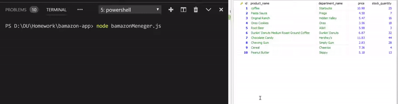

# bamazon-app

The app consist of two programs: 
* bamazonCustomer.js 
* bamazonMeneger.js.

## bamazonCustomer.js
bamazonCustomer.js is a program which helps a user (customer) buy goods.

### How it works
1. The app shows a list of the available products.
2. And offers the customer to buy listed goods.
3. User can pick up the product by ID. And then they may choose how many units they want to buy.
4. In the end, the app shows user's order.

### Example

## bamazonMeneger.js

The program lists a set of menu options:
1. View Products for Sale
If a user selects View Products for Sale, the app should list every available item: the item IDs, names, prices, and quantities.

2. View Low Inventory
If a user selects View Low Inventory, then it should list all items with an inventory count lower than five.

3. Add to Inventory
If a user selects Add to Inventory, your app should display a prompt that will let the user "add more" of any item currently in the store.

4. Add New Product
If a user selects Add New Product, it should allow the user to add a completely new product to the store.

